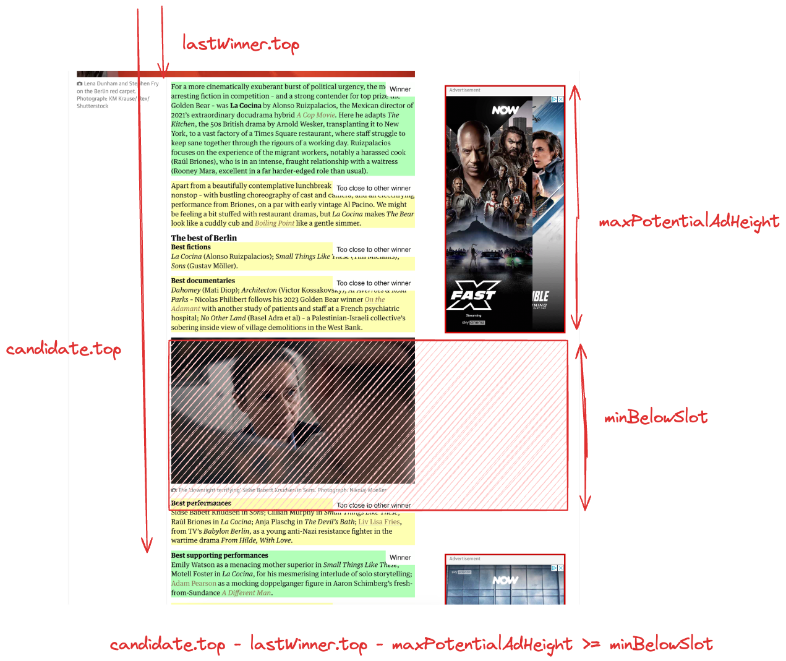

# Spacefinder

Spacefinder identifies slots in articles where ads can be inserted dynamically. Every paragraph is assessed against a set of rules, with 'winning' candidates having ads placed above them.

-   [How Spacefinder works](#how-spacefinder-works)
-   [Spacefinder rules](#spacefinder-rules)
-   [Style and layout of dynamic ads](#style-and-layout-of-dynamic-ads)

Ideally Spacefinder hits the sweet spot between high ad ratio for us and a peerless reading experience for the Guardian website visitors.

---

## How Spacefinder works

Some ad slots on the website are fixed. Come rain or shine, they're there. These include:

-   The banner slot above the navbar on desktop
-   A space to the top right of articles on desktop

By contrast, ad slots identified by Spacefinder vary from page to page. A short article may only have space for one, while a long read ought to fit many more.

Once a page has loaded, Spacefinder cycles through the eligible elements (matching the `candidateSelector` rule) inside the `article-body-commercial-selector` container, highlighted below. (The Adobe / Billie Eilish ad is an example of an ad inserted by Spacefinder.) This may happen in multiple passes for example n desktop inline1 is added first with specific rules because it is inline, then inline2+ are added with different rules because they are in the right rail.

Within this space, 'candidate' elements are assessed if they are far enough from other 'opponent' elements that the candidate must be far enough away from (specified by `opponentSelectorRules`). If the candidate paragraph is far enough away from it's 'opponents', an ad can be added above it. If not, Spacefinder moves on to the next paragraph. Candidate's are also checked if they appear too close to other ads, and if they are too close to the top or bottom of the article.

<table>
    <tr>
        <th>Opponent Above</th>
        <th>Opponent Below</th>
    </tr>
    <tr>
        <td>
            
        </td>
        <td>
            
        </td>
    </tr>
</table>

The space between candidates and opponents is calculated using the ‘getBoundingClientRect().top’ property of the candidate and `top` or `bottom` property of the opponent.

Opponents usually include ads inserted by previous runs of Spacefinder, but can also include other elements such as images, videos and embeds. The `opponentSelectorRules` are used to identify these elements.

Spacefinder will also avoid ads that it has not yet inserted but will be inserted above a winning candidate element, the `filterNearbyAds` function is used for this. This function checks if the candidate is too close to the last winner also taking into account the maximum height of an ad in that slot, see image below.

---

[ [Back to top &uarr;](#spacefinder) ]

---

## Spacefinder rules

There are different rules for different passes see [article-body-adverts.ts](https://github.com/guardian/commercial/blob/main/src/insert/spacefinder/article-body-adverts.ts)

---

[ [Back to top &uarr;](#spacefinder) ]

---

## Style and layout of dynamic ads

On desktop, the first inline ad sits inside the body of the article copy. All subsequent ‘inline’ ads on desktop sit in the white space to the right. On mobile they're all part of the content column.

## Debugging

Adding `?sfdebug` to the URL opens the Spacefinder debugger control panel. The panel contains buttons to show the data for the different times that Spacefinder runs to find space for an ad. You can click these buttons to see the data for that run.

Further reading: https://github.com/guardian/frontend/pull/24618
